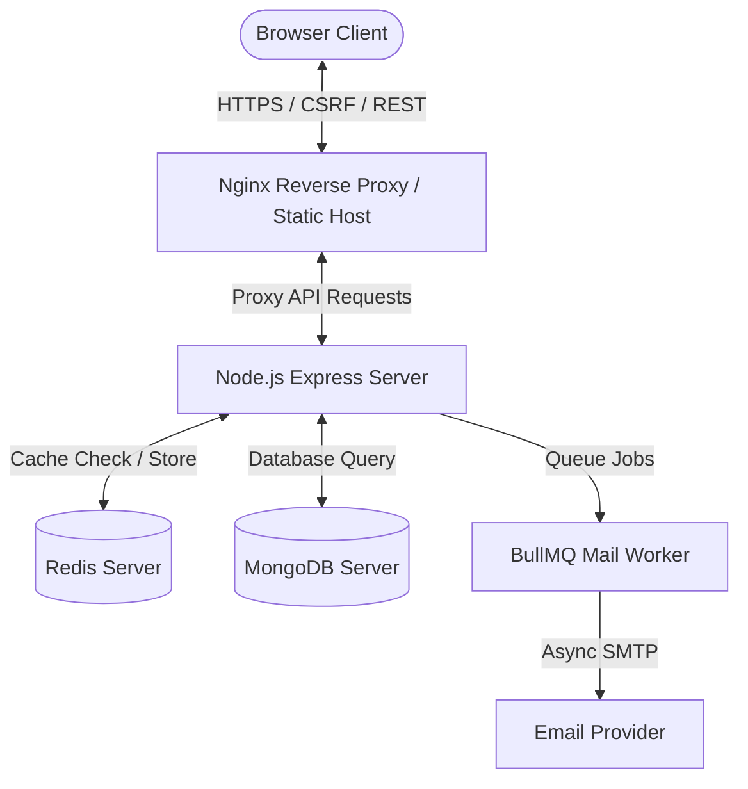
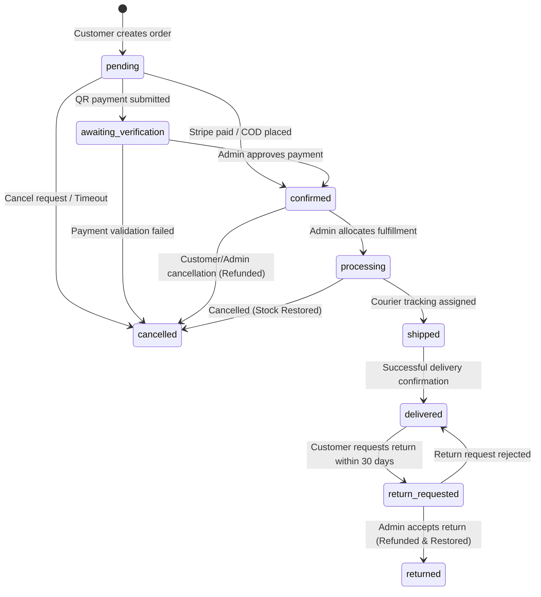

# System Architecture Manual

This document details the system design, file layout, data flow patterns, custom state hooks, and backend service structure for the Luxury Watch E-Commerce application.

---

## 🏗️ System Overview & Design Patterns

The application is built on a modern **MERN Stack (MongoDB, Express, React, Node.js)** reinforced with caching (Redis), transaction handling, robust input validation, and component-based custom hooks.



### 1. Separation of Concerns (Service Layer Architecture)
The backend leverages an isolated **Services Layer** to decouple business logic from HTTP request controllers:
- **Controllers** (e.g. `product.controller.js`, `order.controller.js`): Handle HTTP request parsed arguments, enforce role authorizations, validate inputs, and return structured JSON output.
- **Services** (e.g. `product.service.js`, `order.service.js`, `ipn.service.js`): Contain query operations, model mutations, validation algorithms, external API interactions (Cloudinary, Stripe), cache invalidation rules, and system state transitions.

### 2. Frontend State Management & API Hooks
The frontend follows a reactive, decoupled state philosophy:
- **Zustand Stores** (e.g., `useProductStore`, `useUserStore`, `useCartStore`, `useModalStore`): Centralize shared state, caching lists, and loading indicators.
- **Custom Presentation Hooks** (e.g., `useOrderForm`, `useOrderStatus`, `useDashboardAlerts`): Encapsulate local form mutation state, transitions, real-time polling logic, and concurrent fetch guards.
- **Standardized Fetching Hooks** (e.g., `useApiFetch`, `usePaginatedFetch`): Enforce consistent HTTP header binding, CSRF token handling, and robust loading/error feedback.

---

## 🗂️ Workspace Directory Map

```
watch-ecommerce/
├── .github/workflows/      # GitHub Actions CI/CD configuration
│   └── ci.yml
├── backend/                # Backend API Server
│   ├── config/             # Passport, OAuth, and global configs
│   ├── controllers/        # Thin HTTP Request Handlers
│   ├── lib/                # Database clients (Redis, Mongo), cron tasks
│   ├── middleware/         # Rate limit, CSRF, sanitization, HSTS security
│   ├── models/             # Mongoose Schemas & Index configurations
│   ├── routes/             # REST Route mappings
│   ├── services/           # Decoupled Business Logic (Service Layer)
│   ├── server.js           # API Server Entry Point
│   └── Dockerfile          # Multi-stage production runtime container
├── frontend/               # Frontend Single Page App (SPA)
│   ├── src/
│   │   ├── components/     # Modals, admin tabs, presentational assets
│   │   ├── hooks/          # Reusable custom hooks & API clients
│   │   ├── pages/          # Layout wrappers and router view pages
│   │   └── stores/         # Zustand central stores
│   ├── Dockerfile          # Node.js builder & static serving Nginx
│   └── nginx.conf          # Nginx production proxy config
└── docker-compose.yml      # Root multi-container developer & deployment compose
```

---

## 🔄 Order Lifecycle State Machine

Order processing undergoes a highly verified transition flow to prevent invalid states and double inventory operations.



- **Stock Deductions** occur atomically during transition to `pending`.
- **Stock Restorations** are executed immediately during state transition to `cancelled` or `returned`.
- **Loyalty Points** are credited to the user's account automatically upon reaching `delivered` status, and deducted in case of `refunded` or `returned` state.
