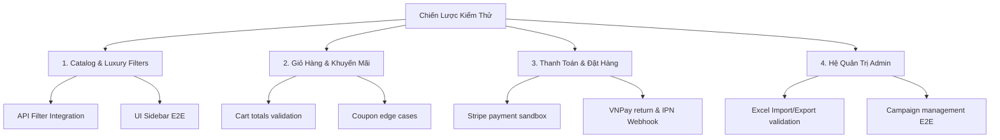

# Kế Hoạch Kiểm Thử Toàn Diện (Comprehensive Testing Plan)
## Hệ Thống E-Commerce Đồng Hồ Cao Cấp (Watch Store)

Tài liệu này phác thảo kế hoạch kiểm thử tự động (E2E, Integration, Unit Test) chi tiết, thực tế và chuẩn hóa nhất cho toàn bộ hệ thống bán lẻ đồng hồ, tập trung vào sự đồng bộ và toàn vẹn dữ liệu từ Giao diện (Frontend) đến API xử lý (Backend) và Cơ sở dữ liệu (Database).

---

## 🧭 BẢN ĐỒ CHIẾN LƯỢC KIỂM THỬ (TESTING MATRIX)

---

## 🛠️ CHI TIẾT CÁC KỊCH BẢN KIỂM THỬ (TEST SUITES)

### Suite 1: Catalog, Taxonomy & Luxury Filtering
*Đảm bảo bộ lọc hoạt động chính xác từ UI cho đến MongoDB Query, xử lý chuẩn xác các định dạng dữ liệu thô.*

| Test ID | Kịch Bản Kiểm Thử | Trạng Thái Precondition | Dữ Liệu Đầu Vào (Input) | Kết Quả Kỳ Vọng (Expected Output) | Cách Thức Xác Minh |
| :--- | :--- | :--- | :--- | :--- | :--- |
| **CAT-01** | Lọc theo bộ máy tiếng Việt chuẩn | DB có đủ sản phẩm cơ, pin, năng lượng ánh sáng. | Truy vấn: `/api/products?machineType=quartz,automatic` | Trả về danh sách chứa sản phẩm có `type: "quartz"` hoặc `"automatic"`. Không được lẫn các type legacy hay rỗng. | API Integration Test |
| **CAT-02** | Xử lý numeric size range phức tạp | Sản phẩm A: `specs.case.diameter = "41.5 mm"`. Sản phẩm B: `sizes = ["38", "39"]`. | Truy vấn: `/api/products?sizeRange=40_42` | Sản phẩm A (41.5mm) được match vì nằm trong khoảng `[40, 42]`. Sản phẩm B bị loại bỏ. Phải parse đúng dấu phẩy/chấm ở số thập phân. | DB Aggregation Unit Test |
| **CAT-03** | Lọc theo chống nước preset | Sản phẩm C có chống nước `"100 m"`. Sản phẩm D có chống nước `"30m"`. | Truy vấn: `/api/products?waterResistance=100,200_plus` | Match sản phẩm C. Loại bỏ sản phẩm D. | Integration Test |
| **CAT-04** | Storefront Brand Filter | Có Brand X (active, 1 sản phẩm), Brand Y (active, 0 sản phẩm), Brand Z (inactive). | Truy vấn mặc định storefront: `/api/brands` | Chỉ xuất hiện Brand X. Không xuất hiện Brand Y và Z để tối ưu trải nghiệm khách hàng. | API Test |
| **CAT-05** | Admin Brand Listing | Như trên. | Truy cập admin hoặc gọi API kèm tham số: `/api/brands?includeEmpty=true` | Trả về cả Brand X và Brand Y (phục vụ mục đích quản trị). Loại bỏ Brand Z. | Admin Integration Test |
| **CAT-06** | Bộ lọc kép Luxury kết hợp | Có 1 chiếc đồng hồ cơ, vỏ thép, mặt kính sapphire, có chức năng GMT. | Truy vấn: `/api/products?machineType=automatic&caseMaterial=Thép&glass=Sapphire&functions=GMT` | Chỉ trả về đúng các mẫu thỏa mãn đồng thời 4 tiêu chí trên. | API Integration Test |

---

### Suite 2: Giỏ Hàng, Tồn Kho & Khuyến Mãi (Cart & Coupon)
*Kiểm thử logic tính tiền, kiểm tra tồn kho đồng thời (race condition) và các điều kiện ràng buộc mã giảm giá.*

| Test ID | Kịch Bản Kiểm Thử | Ràng Buộc Dữ Liệu | Dữ Liệu Đầu Vào (Input) | Kết Quả Kỳ Vọng (Expected Output) | Cách Thức Xác Minh |
| :--- | :--- | :--- | :--- | :--- | :--- |
| **COP-01** | Mã giảm giá hết hạn | Coupon `SALE20` có `expirationDate` trong quá khứ, `isActive: true`. | Áp dụng mã `SALE20` tại Cart/Checkout. | API trả về lỗi `400 Bad Request` với message: "Mã giảm giá đã hết hạn sử dụng". | API Integration Test |
| **COP-02** | Mã giảm giá vượt quá lượt dùng | Coupon `VIP10` có `usedCount: 100` và `maxUses: 100`. | Áp dụng mã `VIP10`. | Trả về lỗi `400` báo mã đã đạt giới hạn sử dụng tối đa. | API Integration Test |
| **COP-03** | Ràng buộc giá trị đơn tối thiểu | Coupon `BIGSUMMER` yêu cầu đơn tối thiểu 20,000,000₫. | Đơn hàng có giá trị sản phẩm 15,000,000₫. | Trả về thông báo lỗi: "Đơn hàng chưa đạt giá trị tối thiểu để áp dụng mã giảm giá". | UI & API E2E |
| **INV-01** | Cạn kiệt tồn kho (Out of Stock) | Sản phẩm có tồn kho bằng 0. | Bấm nút "Thêm vào giỏ hàng" hoặc gửi payload mua hàng. | UI chuyển trạng thái button thành "Hết hàng", chặn thêm vào giỏ. API chặn đặt hàng và báo lỗi tồn kho. | E2E Browser Test |
| **INV-02** | Race Condition Tồn Kho | Sản phẩm chỉ còn 1 mẫu cuối. | 2 luồng người dùng khác nhau cùng bấm đặt hàng tại cùng một tích tắc mili-giây. | Luồng A thanh toán trước thành công. Luồng B bị từ chối với lỗi "Sản phẩm vừa hết hàng, vui lòng cập nhật lại giỏ hàng". | Concurrent Jmeter / K6 Test |

---

### Suite 3: Cổng Thanh Toán & Webhook An Toàn (Payments & Webhooks)
*Mô phỏng các luồng thanh toán ngoại tuyến, xử lý bất đồng bộ từ cổng thanh toán đối tác thứ ba.*

| Test ID | Kịch Bản Kiểm Thử | Cổng Thanh Toán | Quy Trình Luồng Dữ Liệu (Flow) | Kết Quả Kỳ Vọng (Expected Output) | Cách Thức Xác Minh |
| :--- | :--- | :--- | :--- | :--- | :--- |
| **PAY-01** | Đặt hàng COD | Offline | Chọn COD $\rightarrow$ Xác nhận đặt hàng. | Tạo đơn hàng mới trạng thái `Pending/Chờ xác nhận`. Gửi email hóa đơn cho khách. | Playwright E2E Test |
| **PAY-02** | Stripe Payment Sandbox | Stripe | Nhập thẻ test thành công (`4242...`) trên cổng Stripe. | Đơn hàng được tạo thành công, chuyển sang trạng thái `Paid` (Đã thanh toán) qua webhook Stripe. | E2E Playwright Test |
| **PAY-03** | VNPay Return Route | VNPay | Nhập thông tin tài khoản Test VNPay $\rightarrow$ Redirect về `/payment/vnpay-return` với chữ ký MD5 hợp lệ. | FE hiển thị màn hình chúc mừng đặt hàng thành công. Order chuyển trạng thái `Processing`. | E2E Playwright Test |
| **PAY-04** | VNPay IPN Webhook Secure | VNPay | Backend nhận POST request từ máy chủ VNPay tại endpoint `/api/payment/vnpay-ipn` với checksum đúng. | Backend phản hồi kết quả `{ "RspCode": "00", "Message": "Confirm success" }`. Cập nhật trạng thái thanh toán trong DB. | API Integration Test |
| **PAY-05** | VNPay IPN Chữ ký giả mạo | VNPay | Backend nhận request IPN nhưng tham số `vnp_SecureHash` không trùng với chữ ký tự tính toán. | API trả về mã lỗi chữ ký `{ "RspCode": "97", "Message": "Invalid signature" }` để tránh gian lận giao dịch. | Security Pen-Test |

---

### Suite 4: Hệ Quản Trị Danh Mục & Chiến Dịch (Admin Portal)
*Kiểm chứng độ tin cậy của các tính năng nhập xuất hàng loạt và tự động hóa chiến dịch tiếp thị.*

| Test ID | Kịch Bản Kiểm Thử | Hạng Mục | Payload đầu vào / Tệp | Kết Quả Kỳ Vọng (Expected Output) | Cách Thức Xác Minh |
| :--- | :--- | :--- | :--- | :--- | :--- |
| **ADM-01** | Nhập sản phẩm từ Excel (Mới) | Excel Import | File Excel chứa sản phẩm mang danh mục `"Đồng hồ phi công"` và thương hiệu `"Laco"` chưa từng có trong DB. | Hệ thống tự động tạo mới Category `"Đồng hồ phi công"`, tạo Brand `"Laco"`, rồi lưu sản phẩm liên kết với các ID mới. | Service Integration Test |
| **ADM-02** | Nhập sản phẩm Excel (Trùng tên) | Excel Import | File Excel chứa sản phẩm trùng tên đã tồn tại trong DB. | Thực hiện cập nhật đè (Upsert) thông tin tồn kho, giá bán của sản phẩm cũ thay vì tạo bản ghi trùng lặp. | Service Integration Test |
| **ADM-03** | Nhập Excel sai schema dữ liệu | Excel Import | File Excel thiếu cột bắt buộc `Tên sản phẩm` hoặc giá trị `Giá bán` bị âm. | Chặn xử lý giao dịch, rollback toàn bộ danh sách (Transaction), báo lỗi chính xác dòng bị lỗi để Admin sửa. | Transaction Unit Test |
| **ADM-04** | Kích hoạt Chiến dịch giảm giá | Campaign | Tạo chiến dịch giảm giá 10% áp dụng cho nhóm danh mục `Đồng hồ nam` từ ngày X đến ngày Y. | Đúng thời điểm, toàn bộ sản phẩm thuộc danh mục `Đồng hồ nam` được tự động hiển thị giá khuyến mãi trên UI storefront. | Cron Job Integration Test |

---

## 📈 Kế Hoạch Chạy & Đo Lường Độ Phủ (Execution & Metric Coverage)

### 1. Công cụ sử dụng:
*   **Unit & Integration Test:** Sử dụng Runner tích hợp sẵn của Node.js (`node --test`) phối hợp với bộ dữ liệu Mock MongoDB Memory Server để đảm bảo tốc độ chạy cực nhanh (< 5 giây).
*   **End-to-End (E2E) Test:** Sử dụng **Playwright** cho môi trường đa trình duyệt (Chromium, Firefox, WebKit) để chạy các luồng thanh toán và tương tác bộ lọc kéo/thả ở Sidebar.
*   **Performance Test:** Sử dụng **k6** để giả lập luồng giỏ hàng và thanh toán COD với 500 người dùng đồng thời nhằm đo độ trễ API.

### 2. Tiêu chuẩn nghiệm thu (Acceptance Criteria):
*   **Độ phủ mã nguồn (Code Coverage):** Đạt trên **85%** đối với toàn bộ các controller và service cốt lõi ở Backend.
*   **Tỷ lệ thành công (Success Rate):** **100%** các ca kiểm thử hồi quy (Regression test) bắt buộc phải vượt qua thành công trước khi triển khai lên production.
*   **Độ trễ phản hồi (Response Latency):** Phản hồi API danh sách sản phẩm sau lọc phải dưới **200ms** trong điều kiện cơ sở dữ liệu có 10,000 bản ghi.
