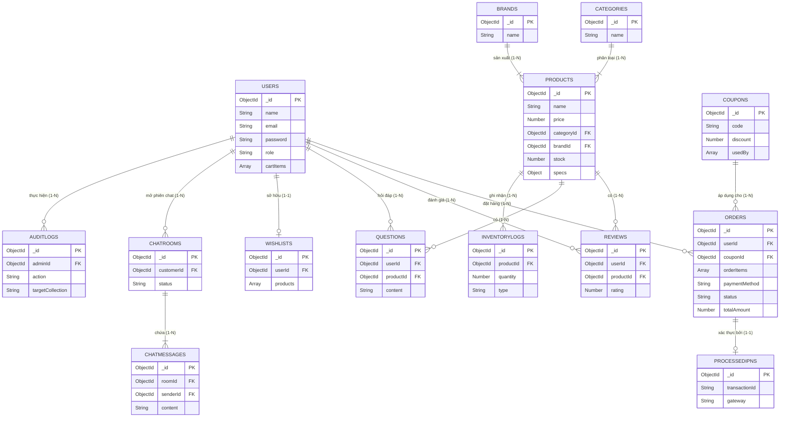

# BÀI TẬP LỚN MÔN PHÁT TRIỂN HỆ THỐNG TMĐT

**ĐỀ TÀI: PHÁT TRIỂN HỆ THỐNG WEBSITE ECOMMERCE ĐỒNG HỒ**
**LỚP:** 04
**SỐ THỨ TỰ NHÓM:** 12

**GIẢNG VIÊN HƯỚNG DẪN:** TS. Lê Văn Vịnh
**SINH VIÊN THỰC HIỆN:** 
1. Nguyễn Duy Hà - B22DCCN256 (TN)
2. Nguyễn Hồng Hải - B22DCCN268

---

## CHƯƠNG I. MÔ TẢ, KHẢO SÁT VÀ XÁC ĐỊNH YÊU CẦU BÀI TOÁN

### 1.1. Mô tả bài toán
Trong bối cảnh thương mại điện tử đang phát triển mạnh mẽ, nhu cầu mua sắm trực tuyến các mặt hàng xa xỉ và phụ kiện cao cấp như đồng hồ ngày càng gia tăng. Bài toán đặt ra là xây dựng một hệ thống website thương mại điện tử chuyên biệt về đồng hồ (TimeMatrix - Luxury Watch Gallery) với quy mô hoàn chỉnh. Hệ thống không chỉ cần đáp ứng các nghiệp vụ bán lẻ trực tuyến thông thường (xem hàng, đặt hàng, thanh toán) mà còn phải cung cấp trải nghiệm mua sắm cao cấp (cá nhân hóa, hỗ trợ AI, chat trực tuyến), đi kèm một hệ thống quản trị (Back-office) mạnh mẽ, tự động hóa sâu và bảo mật cao để tối ưu hóa quy trình vận hành của doanh nghiệp.

### 1.2. Khảo sát, xác định yêu cầu bài toán
Dựa trên việc khảo sát các website thương mại điện tử thực tế và nhu cầu vận hành, hệ thống được thiết kế với các yêu cầu cụ thể như sau:

**a. Yêu cầu chức năng dành cho Khách hàng (Customer-side)**
Hệ thống cần cung cấp một nền tảng mua sắm trực tuyến thuận tiện, bao gồm các phân hệ độc lập sau:
1. **Quản lý Tài khoản cá nhân:** Khách hàng có thể đăng ký, đăng nhập (bằng Email/Mật khẩu hoặc qua Mạng xã hội Google, Facebook, GitHub - OAuth 2.0) và bảo vệ tài khoản cá nhân.
2. **Quản lý Hồ sơ người dùng:** Cho phép khách hàng lưu trữ và cập nhật thông tin liên hệ, quản lý nhiều sổ địa chỉ giao hàng khác nhau.
3. **Khám phá và Tìm kiếm:** Cho phép khách hàng tìm kiếm tự do, lọc và duyệt sản phẩm theo các tiêu chí (giá, thương hiệu, loại máy, giới tính...) kết hợp phân trang phía máy chủ (Server-side Pagination).
4. **Quản lý Giỏ hàng ảo:** Hỗ trợ khách hàng gom nhóm và điều chỉnh số lượng các sản phẩm muốn mua trước khi thanh toán. Dữ liệu giỏ hàng được lưu trữ thông minh (LocalStorage khi chưa đăng nhập và tự động đồng bộ vào CSDL khi đăng nhập).
5. **Xử lý Đặt hàng và Thanh toán:** Hỗ trợ quy trình chốt đơn hàng và cung cấp nhiều phương thức thanh toán linh hoạt (Tiền mặt COD, hoặc trực tuyến qua cổng VNPay, Stripe) có hỗ trợ áp dụng mã giảm giá.
6. **Theo dõi Trạng thái Đơn hàng:** Khách hàng có thể tra cứu lịch sử mua hàng chi tiết và dòng thời gian tiến độ vận chuyển (Tracking Timeline) của các đơn hàng.
7. **Tương tác Cá nhân hóa:** Cung cấp tính năng lưu sản phẩm yêu thích (Wishlist) và so sánh thông số các sản phẩm với nhau. Cung cấp Đa ngôn ngữ (i18n).
8. **Đánh giá và Hỏi đáp:** Cho phép khách hàng để lại nhận xét, chấm điểm sản phẩm (kiểm chứng đã mua hàng) hoặc đặt câu hỏi trực tiếp trên hệ thống.
9. **Giao tiếp & Hỗ trợ tự động (AI Chatbot & Live Chat):** Cung cấp trợ lý ảo thông minh (Gemini/Llama) giúp khách hàng gợi ý sản phẩm tự động dựa trên nhu cầu, và tính năng chat trực tiếp với nhân viên (Socket.io).

**b. Yêu cầu chức năng dành cho Quản trị viên (Admin-side)**
Hệ thống cần cung cấp một trang quản trị tập trung, phân chia rõ ràng thành các module độc lập nhằm phục vụ từng nghiệp vụ vận hành:
1. **Quản lý Báo cáo và Thống kê doanh thu:** Hệ thống cần tổng hợp và trực quan hóa các dữ liệu về doanh thu, hiệu suất bán hàng, tỷ lệ chuyển đổi và sản phẩm bán chạy.
2. **Quản lý Danh mục và Thương hiệu:** Cho phép xây dựng và kiểm soát cấu trúc phân loại sản phẩm (Tạo mới, sửa, xóa các nhóm danh mục, thương hiệu).
3. **Quản lý Sản phẩm:** Cho phép kiểm soát toàn bộ thông tin chi tiết của hàng hóa (Tên, giá bán, hình ảnh, thông số kỹ thuật dạng Embedded Document) và hỗ trợ tính năng nhập liệu hàng loạt (Bulk Import).
4. **Quản lý Tồn kho:** Phân hệ độc lập chuyên biệt (Ledger) để giám sát số lượng hàng hóa thực tế, cập nhật tự động khi có biến động và lưu trữ lịch sử xuất/nhập kho chi tiết.
5. **Quản lý Đơn hàng:** Cung cấp công cụ tiếp nhận, theo dõi luồng xử lý và cập nhật trạng thái vận chuyển. Hệ thống tự động đối soát (Reconciliation) dữ liệu thanh toán từ VNPay/Stripe qua webhook.
6. **Quản lý Khách hàng (CRM):** Cung cấp công cụ để tra cứu thông tin khách hàng, phân loại (gắn thẻ VIP/Cảnh báo), và quản lý hệ thống điểm thưởng (Loyalty).
7. **Quản lý Nhân sự (Internal Users):** Cho phép kiểm soát danh sách tài khoản nội bộ và phân quyền truy cập chức năng chặt chẽ theo vai trò (Admin, Staff).
8. **Quản lý Khuyến mãi:** Cho phép thiết lập, cấu hình các chiến dịch giảm giá tự động (Flash Sale) hoặc tạo các mã thẻ giảm giá (Voucher/Coupon) riêng biệt.
9. **Quản lý Giao diện và Hệ thống (Store Settings):** Cung cấp công cụ để quản lý các nội dung quảng cáo (Banner, Popup), giao diện màu sắc, phí vận chuyển và liên hệ mà không cần sửa code.
10. **Quản lý Chiến dịch Email (Email Marketing):** Cho phép tạo mẫu thư và gửi các thông điệp tiếp thị hàng loạt đến tệp khách hàng nhờ xử lý nền (BullMQ).
11. **Quản lý Tự động hóa (AI Automation):** Tích hợp trí tuệ nhân tạo để tự động nhận diện, phân tích rủi ro và hủy các đơn hàng COD có dấu hiệu spam, đồng thời thanh lọc các tài khoản giả mạo.
12. **Quản lý Phản hồi & Chat Live:** Cung cấp giao diện để nhân sự duyệt/trả lời các câu hỏi, đánh giá từ khách hàng và hỗ trợ trực tuyến thời gian thực (Live Chat qua Socket.io).
13. **Quản lý Lịch sử Hệ thống (Audit Logs):** Hệ thống cần ghi vết mọi thao tác thay đổi dữ liệu của nhân sự (Ai đã làm gì, vào lúc nào) để phục vụ công tác kiểm tra, đối soát.

**c. Yêu cầu Phi chức năng**
Hệ thống cần đáp ứng các tiêu chuẩn kỹ thuật cốt lõi để đảm bảo sự ổn định, an toàn và dễ bảo trì:
1. **Yêu cầu về Bảo mật:** Đảm bảo an toàn dữ liệu người dùng, mã hóa thông tin nhạy cảm (Bcrypt) và thiết lập cơ chế phòng chống các cuộc tấn công mạng (JWT bảo mật, Helmet, Rate-limit). Tài khoản Admin yêu cầu bảo mật 2 lớp (2FA).
2. **Yêu cầu về Tốc độ và Hiệu suất:** Hệ thống phải phản hồi nhanh, chịu tải tốt thông qua các kỹ thuật xử lý nền (Background jobs bằng BullMQ), bộ nhớ đệm (Redis Caching) và phân trang tối ưu.
3. **Yêu cầu về Trải nghiệm Giao diện (UI/UX):** Giao diện phải mang tính thẩm mỹ, thiết kế SPA (React, Vite, Tailwind CSS) dễ điều hướng và tự động tương thích kích thước trên đa thiết bị (Responsive).
4. **Yêu cầu về Môi trường Triển khai:** Hệ thống phải được thiết kế theo kiến trúc hiện đại, lưu trữ NoSQL (MongoDB Atlas), sẵn sàng triển khai lên nền tảng đám mây (Render) kèm theo tên miền riêng và chứng chỉ bảo mật (SSL).
5. **Yêu cầu về Tự động hóa Vận hành (CI/CD):** Hỗ trợ quy trình luân chuyển mã nguồn liên tục từ kho lưu trữ và tự động (auto-deploy) để tối ưu thời gian nâng cấp hệ thống.
6. **Yêu cầu về Tuân thủ pháp lý:** Tuân thủ Luật An ninh mạng 2018, Nghị định 13/2023/NĐ-CP về bảo vệ dữ liệu cá nhân.

---

## CHƯƠNG II. KIẾN THỨC ÁP DỤNG

### 2.1. Phân tích & thiết kế hệ thống
**2.1.1. Biểu đồ phân cấp chức năng (BFD - Business Function Diagram)**

**a. Phân rã chức năng dạng cấu trúc cây:**

**HỆ THỐNG THƯƠNG MẠI ĐIỆN TỬ - ĐỒNG HỒ (CẤP 0)**

**1. Cổng Khách hàng - Customer Portal (Cấp 1)**
  - 1.1. Quản lý Tài khoản (Cấp 2)
    - 1.1.1. Đăng ký & Đăng nhập (Mặc định & OAuth 2.0)
    - 1.1.2. Xác thực Email
    - 1.1.3. Cập nhật Hồ sơ & Sổ địa chỉ
    - 1.1.4. Quên & Đặt lại mật khẩu
  - 1.2. Khám phá Sản phẩm (Cấp 2)
    - 1.2.1. Tìm kiếm bằng từ khóa
    - 1.2.2. Lọc sản phẩm (Giá, Thương hiệu, Giới tính...)
    - 1.2.3. Xem chi tiết sản phẩm
    - 1.2.4. So sánh thông số kỹ thuật
  - 1.3. Quản lý Giỏ hàng (Cấp 2)
    - 1.3.1. Thêm/Xóa sản phẩm
  
**2.1.2. Biểu đồ luồng dữ liệu (DFD - Data Flow Diagram)**

**a. Các thực thể ngoài**
- **Khách hàng (Customer):** Người dùng tương tác với hệ thống để quản lý tài khoản, mua sắm và thanh toán.
- **Quản trị viên (Admin):** Vận hành, quản lý dữ liệu (sản phẩm, đơn hàng, người dùng, cấu hình).
- **Cổng thanh toán (Payment Gateway):** VNPay, Stripe tiếp nhận yêu cầu thanh toán và trả về kết quả đối soát (IPN).
- **Nhà cung cấp OAuth (OAuth Providers):** Google, Facebook, GitHub xác thực và trả về thông tin đăng nhập.

**b. DFD Mức ngữ cảnh (Mức 0)**
Hệ thống Thương mại Điện tử đóng vai trò là một luồng xử lý trung tâm, giao tiếp dữ liệu với các thực thể ngoài:
- **Khách hàng** gửi thông tin cá nhân, yêu cầu đặt hàng, thanh toán, đánh giá và nhận về hóa đơn, trạng thái đơn hàng.
- **Quản trị viên** gửi các lệnh cấu hình, quản lý dữ liệu (sản phẩm, khuyến mãi) và nhận các báo cáo, thông báo hệ thống.
- Hệ thống gửi yêu cầu thanh toán sang **Cổng thanh toán** và nhận về biên lai/trạng thái giao dịch.
- Hệ thống trao đổi token với **OAuth Providers** để cấp quyền đăng nhập cho Khách hàng.
*(Sinh viên chèn ảnh DFD Mức 0 vào đây)*

**c. DFD Mức đỉnh (Mức 1)**
Hệ thống được phân rã thành các tiến trình (Process) lớn, tương tác với các Kho dữ liệu (Data Stores):
- **1.0 - Quản lý Tài khoản & Định danh:** Nhận dữ liệu từ Khách hàng/OAuth, xử lý đăng nhập/đăng ký. Lưu trữ vào kho `D1 (Users)`.
- **2.0 - Khám phá & Quản lý Sản phẩm:** Khách hàng tra cứu sản phẩm từ kho `D2 (Products)`. Admin thêm/sửa/xóa sản phẩm và cập nhật `D3 (Inventory)`.
- **3.0 - Quản lý Giao dịch & Đặt hàng:** Xử lý thêm vào Giỏ hàng, áp dụng Khuyến mãi `D6 (Coupons)` và tạo Đơn hàng lưu vào `D4 (Orders)`.
- **4.0 - Xử lý Thanh toán:** Chuyển hướng thanh toán và cập nhật trạng thái đơn hàng (Thành công/Thất bại) vào `D4 (Orders)` dựa trên IPN từ Payment Gateway.
- **5.0 - Hậu mãi, AI & Tương tác:** Xử lý Đánh giá `D5 (Reviews)`, luồng Live Chat `D7 (Chats)`, và luồng AI Chatbot phân tích yêu cầu. Admin thực hiện CSKH tại đây.
- **6.0 - Thống kê & Báo cáo:** Tổng hợp dữ liệu từ `D2, D4, D1` để xuất báo cáo doanh thu, cảnh báo đơn hàng Spam cho Admin.
*(Sinh viên chèn ảnh DFD Mức 1 vào đây)*

**d. DFD Mức dưới đỉnh (Mức 2) - Phân rã Tiến trình 3.0 (Quản lý Đặt hàng)**
- **3.1 - Quản lý Giỏ hàng:** Tiếp nhận yêu cầu thêm/xóa sản phẩm. Hệ thống kiểm tra số lượng tồn kho khả dụng từ `D3`.
- **3.2 - Áp dụng Mã giảm giá:** Kiểm tra tính hợp lệ và thời hạn của Coupon từ kho `D6`. Tính toán lại tổng giá trị đơn hàng.
- **3.3 - Chốt đơn hàng:** Ghi nhận thông tin giao hàng (Sổ địa chỉ từ `D1`), tính phí vận chuyển và tạo hóa đơn lưu vào `D4`. Chuyển dữ liệu sang tiến trình Thanh toán.
*(Sinh viên chèn ảnh DFD Mức 2 - Tiến trình Đặt hàng vào đây)*

### 2.2. Quản trị hệ thống (System Administration)
Phân hệ Quản trị hệ thống đóng vai trò như "xương sống" kỹ thuật, đảm bảo toàn bộ nền tảng Thương mại điện tử hoạt động an toàn, bảo mật và minh bạch. Phân hệ này bao gồm các chức năng cốt lõi sau:

**2.2.1 Quản lý và Phân quyền truy cập (Role-Based Access Control - RBAC)**
Hệ thống áp dụng cơ chế phân quyền hai chiều chặt chẽ dựa trên vai trò của người dùng, đảm bảo tách biệt hoàn toàn giữa luồng trải nghiệm mua sắm và luồng quản trị vận hành:
- **Customer (Khách hàng):**
  - Đây là vai trò mặc định khi người dùng mới đăng ký tài khoản.
  - Khách hàng chỉ có quyền truy cập vào giao diện cửa hàng (Storefront) để thực hiện các thao tác: Tìm kiếm sản phẩm, thêm vào giỏ hàng, đặt hàng trực tuyến, tra cứu lịch sử mua hàng cá nhân và quản lý hồ sơ/địa chỉ giao hàng của chính mình.
  - Hoàn toàn không có quyền truy cập vào bất kỳ API hay Giao diện quản trị (Dashboard) nào của hệ thống.
- **Admin (Quản trị viên):**
  - Là tài khoản nắm đặc quyền cao nhất của hệ thống, quản lý toàn diện cả Cổng Khách hàng lẫn Cổng Quản trị.
  - Admin có toàn quyền can thiệp vào cơ sở dữ liệu: Thêm/Sửa/Xóa (CRUD) sản phẩm, danh mục, mã giảm giá, banner quảng cáo.
  - Có quyền phê duyệt, cập nhật trạng thái của tất cả các đơn hàng trên hệ thống.
  - Có quyền xem danh sách người dùng, xóa/khóa tài khoản Customer vi phạm và điều chỉnh điểm thưởng.
  - Được phép truy cập vào các báo cáo doanh thu, biểu đồ phân tích thống kê và nhật ký hệ thống (Audit Logs).

**2.2.2 Bảo mật Đăng nhập Quản trị (Admin Security & 2FA)**
Vì tài khoản Quản trị viên nắm giữ thông tin nhạy cảm của toàn bộ doanh nghiệp (Doanh thu, Data khách hàng) hệ thống áp dụng cơ chế bảo mật kép:
- **Xác thực 2 bước (OTP / 2FA):** Khi tài khoản Admin đăng nhập thành công bằng mật khẩu, hệ thống sẽ tạm khóa quyền truy cập và tự động gửi một mã OTP gồm 6 chữ số đến email của quản trị viên. Admin phải nhập đúng mã OTP này mới được cấp phát Access Token để vào Dashboard.
- **Cảnh báo thiết bị lạ:** Hệ thống lưu trữ thông tin địa chỉ IP và User-Agent. Nếu phát hiện Admin đăng nhập từ một thiết bị hoặc vị trí bất thường, hệ thống sẽ tự động gửi email cảnh báo bảo mật.

**2.2.3 Quản lý Cấu hình Hệ thống (Store Configuration)**
Thay vì hard-code (gắn cứng) các thông số trong mã nguồn, hệ thống cho phép Admin thay đổi các cấu hình lõi của cửa hàng một cách linh hoạt ngay trên giao diện:
- **Cấu hình phí vận chuyển:** Tùy chỉnh mức phí ship mặc định, hoặc cấu hình mốc "Freeship" (Miễn phí tất cả các đơn giao hàng toàn quốc cho đơn có giá trị từ 10.000.000đ).
- **Cấu hình hiển thị:** Thay đổi thông tin liên hệ của cửa hàng (Hotline, Email, Địa chỉ, Link mạng xã hội) hiển thị dưới Footer của trang web.

**2.2.4 Ghi vết và Nhật ký hoạt động (Audit Logs)**
Để đảm bảo tính minh bạch trong quá trình làm việc của đội ngũ nhân viên, hệ thống tích hợp phân hệ lưu vết thao tác:
- **Ghi nhận tự động:** Mọi hành động làm thay đổi dữ liệu (Sửa giá sản phẩm, xóa người dùng, hủy đơn hàng, thay đổi cấu hình) đều được tự động ghi lại vào cơ sở dữ liệu “Audit Logs”.
- **Thông tin lưu vết:** Nhật ký sẽ lưu trữ chính xác thông tin: Tên tài khoản thực hiện (Who), Hành động đã làm (Action - Update/Delete), Đối tượng bị tác động (Target ID), Thời gian thực hiện (Timestamp) và Địa chỉ IP truy cập. Admin cấp cao có thể dựa vào đây để đối soát khi có sự cố dữ liệu.

**2.2.5 Tự động hóa dọn dẹp hệ thống (AI & Cronjob Automation)**
Hệ thống được thiết kế để có khả năng "tự chữa lành" và tối ưu hóa tài nguyên server thông qua công nghệ Trí tuệ nhân tạo (AI):
- **Thanh lọc tài khoản ảo (AI Cleanup):** Định kỳ, hệ thống AI sẽ rà soát cơ sở dữ liệu người dùng. Nếu phát hiện các tài khoản có dấu hiệu được tạo ra bởi Bot (tên vô nghĩa, email dạng spam) và không có lịch sử mua hàng, hệ thống sẽ tự động xóa để giải phóng dung lượng Database.
- **Quét rủi ro đơn hàng:** Tự động phân tích các đơn đặt hàng mới có phương thức thanh toán COD. Nếu AI đánh giá đơn hàng có rủi ro cao (địa chỉ ảo, SĐT không hợp lệ), hệ thống sẽ đánh dấu cảnh báo hoặc tự động hủy đơn để tránh thất thoát chi phí vận chuyển cho doanh nghiệp.

**2.2.6 Bảo mật tầng Mạng và Chống tấn công (Network Security & Rate Limiting)**
Dự án triển khai các lớp khiên bảo vệ (Middlewares) ở cấp độ server để ngăn chặn các rủi ro bảo mật:
- **Rate Limiting (Giới hạn yêu cầu):** Hệ thống có cơ chế chặn các cuộc tấn công Brute-force mật khẩu/OTP và giới hạn lượng request của các IP có dấu hiệu spam (DDoS) để bảo vệ tài nguyên máy chủ.
- **CORS & CSRF Protection:** Thiết lập chính sách bảo mật để chỉ cho phép các domain được chỉ định (như `timematrix.io.vn`) gọi API, đồng thời ngăn chặn các cuộc tấn công giả mạo yêu cầu liên trang (CSRF).
- **Input Sanitization (Làm sạch dữ liệu):** Dữ liệu đầu vào từ người dùng luôn đi qua bộ lọc tự động để loại bỏ mã độc (XSS) và các ký tự đặc biệt nguy hiểm trước khi xử lý với CSDL.

**2.2.7 Quản lý Hàng đợi tác vụ ngầm (Background Jobs - BullMQ)**
Để đảm bảo API hoạt động mượt mà và không làm treo luồng chính (block thread) khi xử lý các tác vụ nặng, hệ thống quản trị áp dụng cấu trúc Message Queue:
- **Xử lý bất đồng bộ:** Các tác vụ tiêu tốn nhiều thời gian và tài nguyên như Gửi hàng ngàn Email Marketing chiến dịch, gửi Email chứa mã OTP, hay kết xuất báo cáo doanh thu lớn sẽ được đẩy vào hàng đợi của **BullMQ** (lưu trữ state qua **Redis**). 
- **Tối ưu trải nghiệm:** Giao diện Admin nhận được phản hồi ngay lập tức để người quản trị có thể tiếp tục thao tác khác, trong khi các "Worker" độc lập chạy ngầm để tuần tự hoàn tất các tác vụ này ở phía sau.

### 2.3. Cơ sở dữ liệu (Database Design)
Hệ thống Thương mại điện tử Bán đồng hồ sử dụng hệ quản trị cơ sở dữ liệu phi quan hệ MongoDB, kết hợp với công cụ mô hình hóa dữ liệu Mongoose. Nhờ đặc tính NoSQL linh hoạt (Schema-less), hệ thống có thể lưu trữ đa dạng các thông số kỹ thuật của đồng hồ mà không bị gò bó bởi các cột cố định như CSDL quan hệ. 

**2.3.1 Danh sách các Collection cốt lõi**
Cơ sở dữ liệu bao gồm 23 collections, được chia thành 5 nhóm nghiệp vụ chính:
1. **Nhóm Quản lý Người dùng & Cá nhân hóa:**
   - `users`: Lưu trữ thông tin tài khoản khách hàng và quản trị viên (Tên, Email, Mật khẩu băm, Vai trò, Điểm thưởng). Chứa cả thông tin **Giỏ hàng (Cart)** dưới dạng Embedded Document để tối ưu hiệu suất truy vấn.
   - `wishlists`: Lưu danh sách các sản phẩm yêu thích do người dùng chọn.
2. **Nhóm Quản lý Hàng hóa (Catalog & Inventory):**
   - `products`: Cấu trúc cốt lõi lưu trữ toàn bộ thông tin đồng hồ (Tên, Giá, Ảnh, Tồn kho, Thông số kỹ thuật).
   - `categories`: Danh mục phân loại đồng hồ (Nam, Nữ, Cơ, Pin...).
   - `brands`: Quản lý danh sách các thương hiệu đồng hồ (Rolex, Omega, Seiko...).
   - `inventorylogs`: Ghi nhận lịch sử biến động số lượng tồn kho (Nhập/Xuất kho).
   - `productaudits`: Lưu lại lịch sử các lần chỉnh sửa thông tin sản phẩm của Quản trị viên.
3. **Nhóm Quản lý Đặt hàng & Giao dịch:**
   - `orders`: Lưu thông tin hóa đơn mua hàng (Sản phẩm, Người mua, Tổng tiền, Trạng thái, Địa chỉ).
   - `processedipns`: Lưu vết mã giao dịch (Transaction ID) từ VNPay/Stripe để ngăn chặn việc cộng tiền/xử lý trùng lặp một đơn hàng.
4. **Nhóm Tương tác Khách hàng:**
   - `reviews`: Quản lý các bài đánh giá, chấm điểm sao của khách hàng.
   - `questions`: Lưu trữ câu hỏi thắc mắc của khách hàng trên trang chi tiết sản phẩm.
   - `contacts`: Lưu trữ các yêu cầu liên hệ, hỗ trợ từ khách gửi đến cửa hàng.
   - `chatrooms` & `chatmessages`: Lưu trữ phiên và nội dung lịch sử trò chuyện giữa Khách hàng và Trợ lý ảo AI/Admin.
5. **Nhóm Marketing & Quản trị Hệ thống:**
   - `coupons` & `campaigns`: Quản lý mã giảm giá và các chương trình khuyến mãi tự động.
   - `banners`: Quản lý cấu hình hình ảnh quảng cáo trên giao diện.
   - `newslettersubscriptions`: Lưu danh sách email khách hàng đăng ký nhận tin khuyến mãi.
   - `mailcampaigns`, `emailtemplates`, `emaillogs`: Hệ thống quản lý, thiết kế mẫu và lưu vết lịch sử gửi Email Marketing.
   - `storeconfigs`: Lưu trữ các thông số cấu hình chung của cửa hàng (Phí ship, thông tin liên hệ footer).
   - `auditlogs`: Ghi vết toàn bộ hành động thao tác dữ liệu (Thêm/Sửa/Xóa) của Quản trị viên trên Dashboard.

**2.3.2 Sơ đồ quan hệ thực thể (ERD) - Mức logic**

Do đặc thù của cơ sở dữ liệu phi quan hệ (NoSQL MongoDB), sơ đồ dưới đây mô tả các mối quan hệ logic (References) giữa các Collection cốt lõi dựa trên khóa ngoại (ObjectId) được định nghĩa thông qua Mongoose ODM:



**Phân tích chi tiết Thiết kế Kiến trúc NoSQL (Mối quan hệ và Tối ưu hóa):**

Việc thiết kế CSDL cho hệ thống Thương mại điện tử trên MongoDB đòi hỏi sự kết hợp khéo léo giữa hai mô hình: **Embedded Data** (Dữ liệu nhúng) và **References** (Tham chiếu). Dưới đây là các quyết định thiết kế cốt lõi của dự án:

1. **Tối ưu Giỏ hàng bằng Embedded Array (Quan hệ User - Cart):**
   - Thay vì tạo một bảng `carts` riêng biệt như SQL và tốn chi phí JOIN (Lookup) mỗi lần người dùng xem giỏ hàng, hệ thống nhúng trực tiếp mảng `cartItems` vào collection **Users**. 
   - **Ưu điểm:** Vì giỏ hàng của một người dùng thường có số lượng sản phẩm hữu hạn (vài chục sản phẩm, không bao giờ vượt qua giới hạn 16MB/document của MongoDB), thiết kế này giúp các thao tác CRUD (Thêm/Sửa/Xóa sản phẩm khỏi giỏ) đạt tốc độ truy xuất O(1) bằng các toán tử `$push` và `$pull`.

2. **Khóa cứng Dữ liệu Hóa đơn bằng Denormalization (Quan hệ Order - Product):**
   - Mối quan hệ giữa Đơn hàng và Sản phẩm là N-N. Trong SQL, ta dùng bảng trung gian `Order_Details`. Ở dự án này, thông tin chi tiết từng sản phẩm được nhúng (Embed) thành mảng `orderItems` bên trong collection **Orders**. 
   - **Kỹ thuật Denormalization:** Hệ thống không chỉ lưu `productId` mà lưu cả bản sao của `name`, `price`, và `image` tại đúng thời điểm khách hàng thanh toán. Điều này giúp "khóa cứng" (snapshot) hóa đơn. Nếu Admin thay đổi giá bán hoặc xóa sản phẩm trong tương lai, lịch sử hóa đơn cũ của khách hàng vẫn hiển thị chính xác số tiền và thông tin ban đầu.

3. **Quản lý Tồn kho bằng Sổ cái Ledger (Quan hệ Product - InventoryLog):**
   - Quản lý kho là nghiệp vụ cực kỳ nhạy cảm. Hệ thống không chỉ đơn thuần cập nhật đè (update) thuộc tính `stock` trong bảng **Products**, mà còn tạo ra các bản ghi mới trong bảng **InventoryLogs** (Quan hệ 1-N dạng Reference) cho mỗi lần nhập hàng (IN) hoặc xuất hàng khi có đơn đặt thành công (OUT).
   - **Ưu điểm:** Thiết kế này tạo ra một "Sổ cái" (Ledger) không thể sửa đổi (Immutable), giúp Admin theo dõi chính xác vòng đời của sản phẩm, chống gian lận thất thoát và hỗ trợ kiểm toán (Audit) kho bãi chặt chẽ.

4. **Xử lý Dữ liệu phình to (Unbounded Growth) bằng References (Tương tác & Chat):**
   - Các dữ liệu có xu hướng tăng trưởng vô hạn theo thời gian như **Reviews** (Đánh giá), **Questions** (Hỏi đáp), và **ChatMessages** (Tin nhắn) KHÔNG được nhúng vào trong Products hay Users. Nếu cố tình nhúng, document sẽ nhanh chóng phình to và vi phạm giới hạn 16MB, gây sập hệ thống (Anti-pattern).
   - **Giải pháp:** Hệ thống tách chúng ra thành các collection độc lập và dùng mô hình **References** liên kết chéo qua `userId`, `productId`, và `roomId`. Khi hiển thị chi tiết sản phẩm, hệ thống dùng lệnh truy vấn `.populate()` kết hợp phân trang (Pagination) để chỉ tải 10 bình luận/trang, đảm bảo hiệu năng máy chủ.

5. **Ràng buộc Marketing (Quan hệ Coupon - Order - User):**
   - Bảng **Coupons** liên kết với **Orders** để theo dõi mã giảm giá nào đã được sử dụng. Đồng thời, mỗi mã Coupons chứa mảng danh sách `usedBy` (lưu ObjectId của người dùng).
   - **Ưu điểm:** Giới hạn số lần sử dụng của mỗi khách hàng, chống gian lận lạm dụng khuyến mãi và dễ dàng truy vết các tài khoản săn mã rác.

### 2.4. Ngôn ngữ lập trình và Nền tảng công nghệ
Dự án sử dụng ngôn ngữ lập trình thống nhất là **JavaScript (chuẩn ECMAScript 6+ / ES6+)** cho cả phía máy chủ (Back-End) và phía máy khách (Front-End). Việc sử dụng một ngôn ngữ duy nhất xuyên suốt giúp tối ưu hóa quá trình phát triển, dễ dàng chia sẻ logic và bảo trì mã nguồn.

Dưới đây là danh sách chi tiết các công nghệ và thư viện cốt lõi được áp dụng trong dự án:

**2.4.1 Phía Máy khách (Front-End)**
Giao diện người dùng được xây dựng theo kiến trúc Ứng dụng trang đơn (SPA - Single Page Application) nhằm mang lại trải nghiệm mượt mà, không gián đoạn khi chuyển trang.
- **Thư viện cốt lõi (Core Library):** React.js – Xây dựng các thành phần (Component) giao diện có khả năng tái sử dụng cao.
- **Công cụ biên dịch (Build Tool):** Vite – Thay thế cho Webpack, giúp tốc độ khởi động dự án và biên dịch (Hot Module Replacement) cực kỳ nhanh chóng.
- **Quản lý trạng thái (State Management):** Zustand – Quản lý dữ liệu toàn cục (Giỏ hàng, Thông tin User đăng nhập) nhẹ nhàng và hiệu quả hơn Redux.
- **Thiết kế giao diện (Styling & UI):** Tailwind CSS (Utility-first framework) kết hợp với Lucide-react (Icons) và Framer-motion (Hiệu ứng chuyển động Animation) để xây dựng giao diện tùy chỉnh, mượt mà và chuẩn Responsive đa thiết bị.
- **Giao tiếp HTTP & Real-time:** Axios (gọi API RESTful với cấu hình Interceptors tự động đính kèm Token) và Socket.io-client (kết nối thời gian thực cho tính năng Live Chat).
- **Trực quan hóa Dữ liệu (Data Visualization):** Recharts – Vẽ các biểu đồ thống kê trực quan cho bảng điều khiển (Dashboard) của Admin.
- **Kiểm thử tự động (Testing):** Vitest và Playwright – Hỗ trợ viết các kịch bản kiểm thử giao diện và E2E (End-to-End).

**2.4.2 Phía Máy chủ (Back-End)**
Back-End được thiết kế theo kiến trúc RESTful API, cung cấp dữ liệu định dạng JSON cho cả Web và các ứng dụng di động trong tương lai (nếu có).
- **Nền tảng thực thi & Khung định tuyến:** Node.js và Express.js – Xử lý các yêu cầu (Request) bất đồng bộ ở hiệu suất cao, cung cấp middleware để xử lý logic và phân quyền.
- **Giao tiếp Cơ sở dữ liệu (ODM):** Mongoose – Tương tác với MongoDB, kiểm tra tính hợp lệ dữ liệu (Validation) và ngăn chặn các nguy cơ NoSQL Injection.
- **Xác thực & Bảo mật (Auth & Security):**
  - **Mật khẩu & Phiên đăng nhập:** Bcryptjs (Băm mật khẩu), JsonWebToken (Bảo mật phiên đăng nhập qua Token).
  - **Đăng nhập Mạng xã hội (OAuth 2.0):** Passport.js (hỗ trợ tích hợp đăng nhập qua Google, Facebook, Github).
  - **Chống tấn công:** Helmet (bảo vệ HTTP Headers) và Express-rate-limit (Chống DDoS, Brute-force).
- **Tác vụ ngầm & Bộ nhớ đệm (Queue & Cache):** Redis (thông qua ioredis) làm bộ nhớ đệm tốc độ cao và BullMQ làm hệ thống hàng đợi (Message Queue) chuyên xử lý các tác vụ nặng (như gửi Email) ngầm bên dưới mà không làm treo API chính.
- **Quản lý File & Email:** Cloudinary & Multer (Xử lý upload và lưu trữ hình ảnh trên Cloud), Nodemailer & Handlebars (Thiết kế template và gửi Email Marketing tự động).
- **Tích hợp Trí tuệ nhân tạo (AI):** @google/genai (Gemini API) và groq-sdk (Llama) – Xử lý ngôn ngữ tự nhiên cho Chatbot và tự động phân tích rủi ro đơn hàng.
- **Thanh toán điện tử:** Tích hợp bộ SDK chính thức của VNPay và Stripe để xử lý đối soát giao dịch tự động.

---

## CHƯƠNG III. PHÂN TÍCH THIẾT KẾ HỆ THỐNG

### 3.1. Phân tích thiết kế CSDL
Dựa trên kiến trúc NoSQL MongoDB, hệ thống được thiết kế với hơn 20 collection. Dưới đây là 3 collection quan trọng nhất đóng vai trò "xương sống" cho toàn bộ nền tảng:

**1. Collection `users` (Quản lý Người dùng)**

| Tên trường | Kiểu dữ liệu | Ràng buộc | Mô tả chi tiết |
|---|---|---|---|
| `_id` | ObjectId | Khóa chính (PK) | Mã định danh duy nhất của người dùng do MongoDB tự tạo. |
| `name` | String | Bắt buộc | Họ và tên khách hàng/quản trị viên. |
| `email` | String | Bắt buộc, Duy nhất (Unique) | Địa chỉ email để đăng nhập và liên lạc. |
| `password` | String | | Mật khẩu đã được mã hóa Bcrypt (Không bắt buộc nếu đăng nhập qua OAuth Google/Facebook). |
| `role` | String | Mặc định: `customer` | Quyền truy cập hệ thống (customer, admin, staff). |
| `phone` | String | | Số điện thoại liên hệ. |
| `addresses` | Array<Object> | | Danh sách sổ địa chỉ giao hàng (Tên người nhận, SĐT, Tỉnh/Thành phố...). |
| `cartItems` | Array<Object> | | Dữ liệu Giỏ hàng nhúng trực tiếp (Embed) (Lưu productId, quantity, price). |
| `wishlist` | Array<ObjectId> | Khóa ngoại (FK) | Mảng chứa các ID sản phẩm khách hàng đã bấm yêu thích. |
| `createdAt` / `updatedAt`| Date | Tự động | Thời gian khởi tạo và cập nhật tài khoản. |

**2. Collection `products` (Quản lý Sản phẩm)**

| Tên trường | Kiểu dữ liệu | Ràng buộc | Mô tả chi tiết |
|---|---|---|---|
| `_id` | ObjectId | Khóa chính (PK) | Mã định danh duy nhất của sản phẩm. |
| `name` | String | Bắt buộc | Tên đầy đủ của mặt hàng đồng hồ. |
| `slug` | String | Duy nhất (Unique) | Đường dẫn thân thiện với SEO (Ví dụ: `dong-ho-rolex-submariner`). |
| `brand` / `category` | ObjectId | Khóa ngoại (FK), Bắt buộc | Tham chiếu đến Collection Brand (Thương hiệu) và Category (Danh mục). |
| `price` | Number | Bắt buộc, > 0 | Giá bán niêm yết hiện tại của sản phẩm. |
| `stock` | Number | Bắt buộc, >= 0 | Số lượng hàng tồn kho có thể bán được. |
| `images` | Array<String> | | Danh sách URL hình ảnh sản phẩm (Lưu trữ trên Cloudinary). |
| `specs` | Object | | Dữ liệu nhúng chứa các thông số kỹ thuật (Chất liệu dây, Kiểu máy, Kích thước mặt...). |
| `reviewsCount` | Number | Mặc định: 0 | Tổng số lượt khách hàng đã đánh giá. |
| `averageRating` | Number | Mặc định: 0 | Điểm đánh giá trung bình (1-5 sao). |
| `salesCount` | Number | Mặc định: 0 | Tổng số lượng sản phẩm đã bán ra (dùng để sắp xếp Bán chạy). |
| `deletedAt` | Date | | Đánh dấu thời gian sản phẩm bị ẩn (Soft Delete) thay vì xóa cứng. |
| `createdAt` / `updatedAt`| Date | Tự động | Thời gian khởi tạo và cập nhật thông tin sản phẩm. |

**3. Collection `orders` (Quản lý Giao dịch & Đơn hàng)**

| Tên trường | Kiểu dữ liệu | Ràng buộc | Mô tả chi tiết |
|---|---|---|---|
| `_id` | ObjectId | Khóa chính (PK) | Mã hóa đơn nội bộ của MongoDB. |
| `orderCode` | String | Bắt buộc, Duy nhất | Mã đơn hàng thân thiện dùng cho khách tra cứu (Ví dụ: ORD-12345). |
| `user` | ObjectId | Khóa ngoại (FK), Bắt buộc | Tham chiếu đến khách hàng đặt đơn. |
| `products` | Array<Object> | Bắt buộc | Mảng nhúng dữ liệu sản phẩm tại lúc mua (Lưu cứng productId, name, price, quantity để chống sai lệch nếu giá sau này đổi). |
| `shippingAddress` | Object | Bắt buộc | Thông tin người nhận hàng (Tên, SĐT, Địa chỉ). |
| `paymentMethod` | String | Bắt buộc | Phương thức thanh toán (COD, VNPay, Stripe). |
| `paymentStatus` | String | Mặc định: `Pending` | Trạng thái thanh toán (Pending, Paid, Failed, Refunded). |
| `orderStatus` | String | Mặc định: `Pending` | Trạng thái luồng giao hàng (Pending, Confirmed, Processing, Shipped, Delivered, Cancelled). |
| `totalAmount` | Number | Bắt buộc, > 0 | Tổng tiền thanh toán cuối cùng (Đã trừ khuyến mãi, cộng phí ship). |
| `couponCode` | String | | Mã giảm giá đã được áp dụng (nếu có). |
| `shippingFee` | Number | Mặc định: 0 | Phí giao hàng. |
| `timeline` | Array<Object> | | Lịch sử cập nhật các mốc giao hàng. |
| `loyaltyPointsGranted`| Number | | Số điểm thưởng cộng cho user từ đơn hàng này. |
| `refundAmount` | Number | | Số tiền đã hoàn trả (nếu có sự cố). |
| `returnReason` | String | | Lý do hoàn trả hàng. |
| `internalNotes` | String | | Ghi chú nội bộ của Admin (không hiển thị cho khách). |
| `createdAt` / `updatedAt`| Date | Tự động | Thời gian khởi tạo và cập nhật đơn hàng. |

### 3.2. Phân tích thiết kế chức năng

**3.2.1. Phân hệ Giỏ hàng và Đặt hàng (Cart & Checkout)**

**a. Luồng xử lý Giỏ hàng thông minh (Guest & Logged-in User):**
- **Mục đích:** Tối ưu hóa tỷ lệ chuyển đổi. Khách hàng chưa đăng nhập (Guest) vẫn có thể thêm hàng vào giỏ bình thường.
- **Logic xử lý:**
  - Khi là Guest, hệ thống lưu giỏ hàng vào LocalStorage của trình duyệt. 
  - Khi khách hàng bấm Đăng nhập/Đăng ký, hệ thống sẽ kích hoạt hàm đồng bộ (Merge Cart). Toàn bộ sản phẩm từ LocalStorage sẽ được đẩy lên CSDL (Collection `users`) và gộp chung với giỏ hàng cũ của User đó (nếu có).
- **Ràng buộc:** Khi thêm sản phẩm, hệ thống lập tức đối chiếu với trường `stock` (tồn kho). Nếu quantity > stock, hệ thống báo lỗi không cho phép thêm.

**b. Luồng Đặt hàng và Thanh toán trực tuyến (Sequence):**
- **Mục đích:** Đảm bảo tiền của khách hàng được trừ đúng, đơn hàng được ghi nhận và kho hàng được cập nhật.

*(Hình 3.1. Sơ đồ tuần tự - luồng đặt hàng và thanh toán trực tuyến)*

**3.2.2. Phân hệ Quản lý Tồn kho (Inventory Management)**
- **Mục đích:** Ngăn chặn tình trạng "Bán vượt số lượng" (Overselling) - khách đặt thành công nhưng kho không còn hàng để giao.
- **Logic xử lý:** Hệ thống không tính toán số lượng tồn kho theo kiểu thủ công. Mỗi khi có một sự kiện tác động đến hàng hóa (Nhập kho, Khách đặt hàng, Khách hủy đơn, Trả hàng), hệ thống bắt buộc phải sinh ra một bản ghi mới trong bảng `inventorylogs` với action là IN (Cộng vào) hoặc OUT (Trừ đi).
- **Ngoại lệ (Hủy đơn):** Nếu đơn hàng chuyển từ trạng thái Pending sang Cancelled (Do khách tự hủy hoặc AI hủy), hệ thống sẽ tự động tạo một lệnh IN để hoàn trả (Restore) chính xác số lượng sản phẩm đó ngược lại vào kho, đảm bảo hàng hóa có thể được bán cho người khác.

**3.2.3. Phân hệ Trợ lý ảo AI (AI Chatbot Automation)**
- **Mục đích:** Tăng trải nghiệm khách hàng 24/7, tự động tư vấn các mẫu đồng hồ phù hợp với ngân sách của khách.
- **Logic xử lý (RAG - Retrieval-Augmented Generation cơ bản):**
  - Khách hàng nhắn: "Tôi có khoảng 10 triệu, muốn mua đồng hồ Rolex hoặc Seiko".
  - Xử lý Regex/Parser: Hệ thống BE dùng biểu thức chính quy (Regex) trích xuất từ khóa: Ngân sách = ~10.000.000đ, Brand = Rolex, Seiko.
  - Truy vấn DB: BE truy xuất CSDL MongoDB để tìm Top 5 sản phẩm khớp với tiêu chí trên (còn hàng).
  - Gửi Prompt cho AI: Cấu trúc Prompt bao gồm: Đóng vai nhân viên bán hàng + Quy tắc không được bịa đặt + Danh sách 5 sản phẩm vừa tìm được + Câu hỏi của khách.
  - Trả lời: Mô hình AI (Gemini/Llama) đọc danh sách sản phẩm thực tế của cửa hàng và sinh ra câu trả lời tự nhiên, thân thiện. Đồng thời giao diện FE sẽ tự động vẽ (Render) các thẻ (Card) sản phẩm đó ra màn hình chat.

*(Hình 3.2. Sơ đồ tuần tự - luồng Tư vấn tự động của AI Chatbot)*

**3.2.4. Phân hệ Xử lý Email và Tác vụ ngầm (Background Jobs)**
- **Mục đích:** Đảm bảo hiệu suất của API luôn đạt mức mili-giây (ms), không bắt người dùng phải "chờ" trình duyệt quay mòng mòng khi gửi email.
- **Logic xử lý:**
  - Thay vì gọi trực tiếp thư viện Nodemailer để gửi mail ngay lúc khách bấm nút (sẽ mất khoảng 2-3 giây để kết nối SMTP), hệ thống đẩy nhiệm vụ (Job) gửi mail này vào Hàng đợi (Message Queue bằng BullMQ & Redis).
  - API lập tức phản hồi (Response 200 OK) cho trình duyệt.
  - Ở dưới nền (Background Worker), một tiến trình (Process) độc lập sẽ từ từ lôi các nhiệm vụ trong Hàng đợi ra để gửi Email xác nhận, Email mã OTP hoặc Email Marketing hàng loạt. Nếu gửi lỗi, hàng đợi sẽ tự động thử lại (Retry) 3 lần.

**3.2.5. Phân hệ Tự động hóa Bảo mật (AI Spam Detection)**
- **Mục đích:** Giảm tải công sức duyệt đơn của Admin, ngăn chặn đối thủ tạo đơn rác (Spam) để giam hàng (khiến sản phẩm bị trừ tồn kho giả).
- **Logic xử lý:**
  - Mỗi khi có Đơn hàng mới chọn phương thức COD (Nhận hàng trả tiền), một kịch bản AI sẽ được kích hoạt ngầm.
  - AI sẽ phân tích các trường thông tin: Tên người nhận (có chứa ký tự lạ, chữ "test", "bot" không?), Số điện thoại (có đúng định dạng mạng VN không?), Địa chỉ (có phải địa chỉ ma không?).
  - Nếu AI kết luận là SPAM (Độ tin cậy > 90%), hệ thống tự động đổi trạng thái đơn thành Cancelled, ghi log `[AI] Tự động hủy`, và hoàn trả tồn kho ngay lập tức. Ngược lại, nếu là khách thật, AI sẽ tự động Confirmed đơn hàng.

**3.2.6. Phân hệ Xác thực và Bảo mật (Auth & Security)**
- **Mục đích:** Đảm bảo danh tính người dùng được xác minh an toàn, bảo vệ tài khoản khỏi các cuộc tấn công (Brute-force, đánh cắp phiên đăng nhập) và cung cấp cơ chế khôi phục tài khoản khi khách hàng quên mật khẩu.
- **Logic xử lý cốt lõi:**
  - **Mã hóa mật khẩu một chiều:** Mật khẩu của người dùng khi đăng ký sẽ không bao giờ được lưu dưới dạng văn bản thô (Plain-text). Thay vào đó, hệ thống sử dụng thuật toán Bcrypt để băm (hash) kết hợp với muối (Salt). Kể cả khi Hacker chiếm quyền truy cập CSDL, họ cũng không thể dịch ngược ra mật khẩu gốc.
  - **Phiên đăng nhập (Session) không trạng thái:** Sử dụng JSON Web Token (JWT). Thay vì lưu trạng thái đăng nhập ở server (tốn RAM), hệ thống cấp cho trình duyệt một chuỗi mã hóa (Access Token & Refresh Token) được lưu an toàn trong HTTP-only Cookie nhằm chống lại tấn công XSS (Cross-Site Scripting).
  - **Giới hạn thời gian (Time-To-Live):** Các luồng nhạy cảm (Xác thực Email, Đổi mật khẩu) đều sinh ra một đoạn mã Token ngẫu nhiên (dài 32 byte) kèm theo một trường expires (Hạn sử dụng, thường là 15 phút). Nếu quá thời gian này, Token tự động bị vô hiệu hóa.

*(Hình 3.3. Sơ đồ tuần tự - luồng Khôi phục mật khẩu)*

**3.2.7. Phân hệ Quản lý Khuyến mãi (Coupon & Campaign)**
- **Mục đích:** Hỗ trợ các chiến dịch Marketing, tăng doanh số nhưng phải đảm bảo không bị khách hàng lợi dụng lỗ hổng để xài mã giảm giá nhiều lần (Abuse).
- **Logic xử lý:** 
  - Khi khách nhập mã `COUPON`, hệ thống kiểm tra 4 điều kiện: (1) Mã có tồn tại và còn hạn không? (2) Đơn hàng có đạt giá trị tối thiểu không? (3) Lượt dùng tối đa (Usage Limit) đã hết chưa? (4) Khách hàng này (dựa vào `userId`) đã từng dùng mã này chưa?
  - Nếu thỏa mãn, API trả về số tiền được giảm (`discountAmount`) để FE cập nhật giao diện.
- **Ràng buộc:** Khi đơn hàng chuyển sang trạng thái "Paid", ObjectId của khách hàng mới chính thức được `$push` vào mảng `usedBy` của Collection `coupons` để đánh dấu đã sử dụng. Nếu khách hủy đơn, hệ thống tự động `$pull` userId ra để khách xài lại được.

**3.2.8. Phân hệ Đánh giá Sản phẩm (Verified Purchase Reviews)**
- **Mục đích:** Xây dựng lòng tin cho khách hàng mới thông qua các đánh giá chân thực, chống lại tình trạng đánh giá ảo (Seeding/Spam).
- **Logic xử lý:**
  - Khách hàng bấm Đánh giá sản phẩm. Hệ thống kiểm tra trong Collection `orders`: Khách hàng này đã từng mua sản phẩm này chưa? Trạng thái đơn hàng có phải là `Delivered` (Đã giao thành công) không?
  - Nếu đúng, cho phép lưu Review (chấm sao + nhận xét) vào Collection `reviews` và gán nhãn "Đã mua hàng". Sau đó, hệ thống tự động chạy ngầm một phép tính trung bình (Aggregate) để cập nhật lại trường `averageRating` của sản phẩm đó.
- **Ràng buộc:** Mỗi khách hàng chỉ được đánh giá 1 lần cho 1 sản phẩm đã mua để tránh spam kéo rate.

**3.2.9. Phân hệ Quản trị và Lưu vết (RBAC & Audit Logs)**
- **Mục đích:** Đảm bảo an toàn dữ liệu nội bộ, ngăn chặn nhân viên (Staff) lạm quyền và theo dõi mọi thay đổi trong hệ thống.
- **Logic xử lý:**
  - Khi một tài khoản Admin/Staff gọi API tác động đến dữ liệu (Ví dụ: Thay đổi giá sản phẩm từ 10tr xuống 5tr). Middleware của hệ thống sẽ can thiệp trước tiên để chặn nếu Staff không đủ quyền.
  - Sau khi đổi giá thành công, hệ thống tự động sinh ra một bản ghi trong Collection `auditlogs` với nội dung: `Who` (Admin X), `Action` (Update Price), `Target` (Sản phẩm Y), `Old Value` (10tr), `New Value` (5tr), `Time` (Lúc 14:00).
- **Ràng buộc:** Collection `auditlogs` là collection chỉ cho phép Đọc/Thêm (Read/Insert), tuyệt đối không cung cấp API Xóa/Sửa cho bất kỳ ai, kể cả Super Admin.

---

## CHƯƠNG IV. CÀI ĐẶT VÀ HƯỚNG DẪN SỬ DỤNG

Chương này sẽ hướng dẫn chi tiết các bước cần thiết để cấu hình môi trường, thiết lập cơ sở dữ liệu và triển khai dự án Thương mại điện tử Bán đồng hồ (MERN Stack) lên môi trường chạy thực tế (Render). 

### 4.1. Cài đặt CSDL (Database Setup)
Hệ thống sử dụng hệ quản trị cơ sở dữ liệu MongoDB. Do đây là CSDL dạng NoSQL (Schema-less), kết hợp với thư viện Mongoose (ODM), bạn không cần phải chạy các file script tạo bảng (ví dụ .sql) phức tạp. Mongoose sẽ tự động quét và khởi tạo các bảng (Collections) ngay khi dự án được khởi động lần đầu tiên.
Có 2 cách để thiết lập CSDL cho dự án này: Cài đặt cục bộ (Local) hoặc Sử dụng dịch vụ Đám mây (Cloud). Trong thực tế triển khai trên Render, dự án sử dụng MongoDB Atlas (Cloud).

**4.1.1. Khởi tạo Cơ sở dữ liệu trên Đám mây (MongoDB Atlas)**
Đây là phương pháp tối ưu và bắt buộc khi dự án được đưa lên môi trường trực tuyến (Production).
- **Bước 1: Đăng ký và tạo Cluster.** Truy cập trang chủ `mongodb.com/cloud/atlas` và đăng nhập/đăng ký tài khoản. Tạo một Dự án (Project) mới. Chọn "Build a Database" và chọn gói M0 Free / Shared Cluster. Chọn nhà cung cấp dịch vụ Cloud (AWS, Google Cloud) và khu vực (Region) gần Việt Nam nhất (Singapore/HongKong). Nhấn "Create Cluster".
- **Bước 2: Cấu hình Bảo mật và Quyền truy cập.** Chuyển sang mục Database Access: Tạo một tài khoản truy cập CSDL (Username và Password). Chuyển sang mục Network Access: Chọn "Add IP Address" và thêm địa chỉ `0.0.0.0/0` (Allow access from anywhere). Điều này cho phép máy chủ Render có thể kết nối vào MongoDB Atlas.
- **Bước 3: Lấy chuỗi kết nối (Connection String).** Quay lại mục Database, chọn nút Connect ở Cluster vừa tạo. Chọn phương thức "Drivers" (Node.js). Copy đoạn mã kết nối (URI) do MongoDB cung cấp. 

**4.1.2. Cài đặt Bộ nhớ đệm và Hàng đợi (Redis Database)**
Dự án có sử dụng thư viện BullMQ để xử lý các tác vụ ngầm (Background Jobs) như Gửi Email Marketing. Do đó, hệ thống bắt buộc cần thêm CSDL Redis.
- Đăng ký tài khoản trên Upstash (hoặc sử dụng Redis cung cấp trên Render).
- Tạo một Database Redis mới.
- Copy chuỗi kết nối URI của Redis.

**4.1.3. Cấu hình biến môi trường (Environment Variables)**
Sau khi đã có đầy đủ các thông tin CSDL từ MongoDB Atlas và Redis, cần tiến hành kết nối chúng vào mã nguồn Back-end bằng cách tạo file `.env` ở thư mục `backend` và khai báo:

```env
# Môi trường chạy
NODE_ENV=production
PORT=5000

# 1. Cấu hình MongoDB
MONGODB_URI=mongodb+srv://<username>:<password>@cluster0.abcde.mongodb.net/watchstore_db?retryWrites=true&w=majority

# 2. Cấu hình Redis (Cho BullMQ / Email Queue)
REDIS_URL=rediss://default:<password>@<your-upstash-endpoint>:6379

# 3. Cấu hình AI Chatbot
GEMINI_API_KEY=AIzaSy...

# 4. Cấu hình Upload hình ảnh (Cloudinary)
CLOUDINARY_CLOUD_NAME=xxx
CLOUDINARY_API_KEY=xxx
CLOUDINARY_API_SECRET=xxx

# 5. Cấu hình Thanh toán và Email
VNPAY_TMM_CODE=xxx
SMTP_EMAIL=your-email@gmail.com
SMTP_PASSWORD=xxx
```

### 4.2. Cài đặt giả lập môi trường server hosting
Để hệ thống E-commerce hoạt động trơn tru trên môi trường giả lập cục bộ (Localhost), máy tính cần đóng vai trò vừa là Máy chủ (Server / Back-end) vừa là Máy khách (Client / Front-end).

**4.2.1. Yêu cầu hệ thống (Prerequisites)**
Trước khi tiến hành, máy tính giả lập cần được cài đặt các phần mềm nền tảng sau:
- **Node.js (Phiên bản LTS 18.x hoặc 20.x):** Đóng vai trò là Runtime Environment thực thi mã nguồn JavaScript ngoài trình duyệt. (Tải tại: nodejs.org)
- **NPM hoặc Yarn:** Trình quản lý thư viện, được cài đặt tự động kèm theo Node.js.
- **Git:** Công cụ quản lý mã nguồn (Tùy chọn, dùng để clone dự án).

**4.2.2. Khởi chạy Máy chủ Backend (API Server)**
Máy chủ Backend chịu trách nhiệm giao tiếp với Database MongoDB, xử lý logic thanh toán, AI và bảo mật.

- **Bước 1:** Mở công cụ dòng lệnh (Terminal / Command Prompt / PowerShell) và di chuyển vào thư mục Backend của dự án:
  ```bash
  cd watch-ecommerce/backend
  ```
- **Bước 2:** Cài đặt toàn bộ các thư viện/dependencies cần thiết đã được khai báo trong file `package.json`:
  ```bash
  npm install
  ```
- **Bước 3:** Khởi động Server:
  ```bash
  npm run dev
  ```
- **Bước 4: Nạp dữ liệu khởi tạo tài khoản Quản trị viên (Admin Seeding)**
  Mặc định khi CSDL mới khởi tạo, hệ thống sẽ chưa có tài khoản Admin nào để quản trị nội dung. Dự án đã chuẩn bị sẵn một script để tự động cấp quyền. Mở một Terminal mới tại thư mục gốc và chạy:
  ```bash
  node backend/scripts/seed-admin.js
  ```
  Lệnh này sẽ chèn một tài khoản Admin cấp cao mặc định:
  - **Tên đăng nhập (Email):** `admin@gmail.com`
  - **Mật khẩu:** `123456789`

**4.2.3. Khởi chạy Giao diện Frontend (Client App)**
Giao diện Frontend được xây dựng bằng React.js và Vite, cần được giả lập chạy song song trên một cổng (Port) riêng biệt.

- **Bước 1:** Mở một cửa sổ Terminal mới *(lưu ý: không tắt Terminal của Backend đang chạy)* và di chuyển vào thư mục Frontend:
  ```bash
  cd watch-ecommerce/frontend
  ```
- **Bước 2:** Khởi tạo và cài đặt các thư viện cần thiết (React, Zustand, TailwindCSS, Axios...):
  ```bash
  npm install
  ```
- **Bước 3:** Khởi chạy máy chủ phát triển (Dev Server) của Vite:
  ```bash
  npm run dev
  ```

> **Ghi chú trải nghiệm:** 
> Máy chủ Vite thường sẽ tự động cấp phát một đường dẫn nội bộ cục bộ. Bạn hãy mở trình duyệt (Chrome/Edge) và truy cập vào:
> - **[http://localhost:5173](http://localhost:5173):** Để trải nghiệm Website mua sắm dưới góc độ của Khách hàng.
> - **[http://localhost:5173/login](http://localhost:5173/login):** Đây là cổng đăng nhập tập trung. Tại đây, bạn có thể đăng nhập bằng tài khoản `admin@gmail.com` vừa được cấp ở bước Seeding. Hệ thống sẽ tự động nhận diện quyền Quản trị viên và chuyển hướng bạn vào trang Admin Dashboard.

**4.2.4. Lưu ý quan trọng khi triển khai (Deployment Note)**
Phần 4.2.2 và 4.2.3 mô tả quá trình cài đặt và giả lập trên máy cá nhân (Localhost). Trong thực tế, dự án này không chạy thủ công trên máy tính mà được áp dụng quy trình triển khai tự động hóa (CI/CD) lên nền tảng đám mây Render (Cloud PaaS), kết hợp với Tên miền tùy chỉnh (Custom Domain).

Cơ chế triển khai thực tế trên Render diễn ra tuần tự như sau:
1. Quản trị viên đẩy (Push) mã nguồn mới nhất lên kho lưu trữ GitHub.
2. Webhook của Render lập tức phát hiện sự thay đổi và tự động tải (Pull) mã nguồn về máy chủ.
3. Render thực thi lệnh cài đặt các thư viện: `npm install`.
4. Render tự động chạy lệnh đóng gói Frontend: `npm run build` *(Biến mã React thành các tệp HTML/CSS/JS tĩnh thuần túy để tối ưu hóa tốc độ tải trang)*.
5. Cuối cùng, Render tự động cấp phát chứng chỉ bảo mật SSL (`https://`) cho tên miền của dự án và gắn (Bind) vào ứng dụng để công khai lên Internet.

> **Kết luận:** Nhờ ứng dụng kiến trúc Đám mây hiện đại này, quản trị viên không cần phải treo máy tính 24/24 để làm hosting, mà hệ thống vẫn luôn duy trì độ ổn định cao, sẵn sàng phục vụ hàng ngàn khách hàng tại bất kỳ thời điểm nào.

### 4.3. Giao diện User
- 4.3.1. Giao diện trang chủ *(Chèn ảnh)*
- 4.3.2. Giao diện trang danh mục sản phẩm (Catalog) *(Chèn ảnh)*
- 4.3.3. Giao diện trang chi tiết sản phẩm *(Chèn ảnh)*
- 4.3.4. Giao diện trang tìm kiếm sản phẩm *(Chèn ảnh)*
- 4.3.5. Giao diện trang đăng nhập *(Chèn ảnh)*
- 4.3.6. Giao diện trang đăng ký tài khoản *(Chèn ảnh)*
- 4.3.7. Giao diện trang quên mật khẩu & đặt lại mật khẩu *(Chèn ảnh)*
- 4.3.8. Giao diện trang hồ sơ cá nhân (Profile) *(Chèn ảnh)*
- 4.3.9. Giao diện trang giỏ hàng *(Chèn ảnh)*
- 4.3.10. Giao diện trang thanh toán (Checkout) *(Chèn ảnh)*
- 4.3.11. Giao diện trang hình thức thanh toán (VNPay/Stripe) *(Chèn ảnh)*
- 4.3.12. Giao diện trang kết quả đặt hàng (Thành công/Hủy) *(Chèn ảnh)*
- 4.3.13. Giao diện trang quản lý và theo dõi đơn hàng *(Chèn ảnh)*
- 4.3.14. Giao diện trang sản phẩm yêu thích (Wishlist) và So sánh *(Chèn ảnh)*
- 4.3.15. Giao diện trang giải đáp thắc mắc (FAQ) *(Chèn ảnh)*
- 4.3.16. Giao diện trang liên hệ *(Chèn ảnh)*
- 4.3.17. Giao diện trang Chatbot AI *(Chèn ảnh)*
- 4.3.18. Giao diện khu vực liên kết các mạng xã hội (Footer) *(Chèn ảnh)*

### 4.4. Giao diện Admin
- 4.4.1. Giao diện trang đăng nhập phần Admin *(Chèn ảnh)*
- 4.4.2. Giao diện trang chủ Admin (Bảng điều khiển / Thống kê) *(Chèn ảnh)*
- 4.4.3. Giao diện trang quản lý đơn hàng *(Chèn ảnh)*
- 4.4.4. Giao diện trang quản lý danh mục *(Chèn ảnh)*
- 4.4.5. Giao diện trang quản lý sản phẩm *(Chèn ảnh)*
- 4.4.6. Giao diện trang thêm mới sản phẩm *(Chèn ảnh)*
- 4.4.7. Giao diện trang sửa/xóa sản phẩm *(Chèn ảnh)*
- 4.4.8. Giao diện trang quản lý kho hàng (Inventory / Nhập xuất kho) *(Chèn ảnh)*
- 4.4.9. Giao diện trang quản lý tài khoản người dùng *(Chèn ảnh)*
- 4.4.10. Giao diện trang quản lý khuyến mãi (Coupons / Campaign) *(Chèn ảnh)*
- 4.4.11. Giao diện trang quản lý đánh giá (Reviews) *(Chèn ảnh)*
- 4.4.12. Giao diện trang cấu hình Hệ thống AI *(Chèn ảnh)*
- 4.4.13. Giao diện trang cài đặt hiển thị cửa hàng (Banner/Store Settings) *(Chèn ảnh)*
- 4.4.14. Giao diện trang lưu vết hệ thống (Audit Logs) *(Chèn ảnh)*

---

## CHƯƠNG V. KẾT LUẬN

### 5.1. Kết quả đạt được của đề tài
Sau quá trình nghiên cứu, phân tích và triển khai, dự án "Phát triển hệ thống website Thương mại điện tử Đồng Hồ" đã hoàn thành các mục tiêu cốt lõi đề ra ban đầu. Đề tài không chỉ giải quyết trọn vẹn bài toán nghiệp vụ kinh doanh trực tuyến mà còn ứng dụng thành công các công nghệ mới.
Những thành tựu nổi bật của dự án bao gồm:
- **Về mặt Vận hành thực tế (Production):** Dự án không dừng lại ở mức thử nghiệm trên máy tính cá nhân (localhost) mà đã giải quyết thành công bài toán DevOps. Hệ thống hiện đang được triển khai (deploy) hoàn thiện trên nền tảng đám mây, vận hành ổn định và có thể truy cập trực tiếp tại tên miền chính thức: [https://timematrix.io.vn](https://timematrix.io.vn)
- **Về mặt Công nghệ và Kiến trúc (Technical & Architecture):**
  - Ứng dụng nhuần nhuyễn hệ sinh thái MERN Stack (MongoDB, Express, React, Node.js), kết hợp với thư viện Zustand và TailwindCSS để tạo ra giao diện SPA (Single Page Application) mượt mà, tối ưu trải nghiệm người dùng trên cả PC lẫn Mobile.
  - Tối ưu hóa hiệu năng máy chủ thông qua hệ thống Hàng đợi tác vụ ngầm (Background Jobs) sử dụng BullMQ và Redis. Điều này giúp hệ thống xử lý trơn tru các tác vụ nặng (như gửi Email tự động) mà không gây tắc nghẽn trải nghiệm mua sắm.
  - Thiết kế Cơ sở dữ liệu (Database Design) chặt chẽ, tuân thủ nguyên tắc phi chuẩn hóa (Denormalization) của NoSQL. Đảm bảo toàn vẹn dữ liệu tài chính thông qua cơ chế lưu vết (Audit Logs) và sổ kho (Inventory Logs) chuyên nghiệp.
- **Về mặt Đổi mới Sáng tạo (Innovation):** Điểm sáng lớn nhất của dự án là việc tích hợp thành công Trí tuệ nhân tạo (AI) vào hệ thống. Cụ thể, dự án đã xây dựng được một Trợ lý ảo AI có khả năng đọc hiểu kho dữ liệu sản phẩm để tư vấn trực tiếp cho khách hàng, đồng thời ứng dụng AI vào việc tự động phân tích và loại bỏ các đơn hàng rác (Spam Detection), giúp giảm thiểu đáng kể khối lượng công việc cho Quản trị viên.

### 5.2. Khó khăn và hạn chế trong quá trình thực hiện
Dù đạt được nhiều kết quả khả quan, quá trình thực hiện đề tài vẫn tồn tại một số khó khăn và hạn chế nhất định do giới hạn về nguồn lực cá nhân và thời gian nghiên cứu:
- Khó khăn trong việc thiết lập và đối soát tính toàn vẹn của dữ liệu giao dịch (Idempotency) khi kết nối với các Cổng thanh toán bên thứ 3 (Webhook/IPN từ VNPay, Stripe). Đòi hỏi phải xử lý khéo léo để ngăn chặn lỗi cộng tiền hoặc trừ kho nhiều lần cho cùng một hóa đơn.
- Chưa tích hợp được hệ thống tính phí vận chuyển theo thời gian thực (Real-time Shipping Calculation) trực tiếp từ các hãng vận chuyển do vướng mắc về thủ tục đăng ký API doanh nghiệp. Phí vận chuyển hiện tại vẫn đang phải thiết lập thủ công.
- Cấu trúc dữ liệu hiện tại mới chỉ hỗ trợ phục vụ khách hàng nội địa (Giao diện Tiếng Việt và thanh toán VNĐ), chưa mở rộng được ngôn ngữ và đa tiền tệ.

### 5.3. Lời kết
Đồ án "Phát triển hệ thống website Thương mại điện tử" là một dấu mốc quan trọng, mang lại cho nhóm chúng em cơ hội vô giá để củng cố kiến thức lý thuyết và vận dụng trực tiếp vào việc giải quyết một bài toán phần mềm thực tế. Sự hình thành và vận hành thành công của trang web [timematrix.io.vn](https://timematrix.io.vn) không chỉ là thành quả của quá trình nỗ lực lập trình ngày đêm, mà còn là minh chứng cho tinh thần tự học hỏi không ngừng các công nghệ mới (như hệ sinh thái Cloud, Redis, Docker, AI) của cả nhóm.

Nhân dịp hoàn thành đồ án này, nhóm chúng em xin gửi lời cảm ơn chân thành và sâu sắc nhất đến Giảng viên hướng dẫn - TS. Lê Văn Vịnh. Những lời nhận xét, định hướng chuyên môn và sự tận tâm của Thầy chính là kim chỉ nam giúp nhóm vượt qua những bế tắc về mặt kỹ thuật để hoàn thiện đề tài một cách trọn vẹn nhất. Đồng thời, xin gửi lời tri ân đến các Thầy Cô trong Khoa đã luôn tạo điều kiện học tập tốt nhất cho chúng em.

Mặc dù đã rất cố gắng hoàn thiện, nhưng do giới hạn về mặt thời gian và kinh nghiệm thực tiễn, hệ thống chắc chắn không tránh khỏi những thiếu sót. Nhóm chúng em rất mong nhận được sự góp ý và chỉ bảo thêm từ các Thầy Cô để dự án ngày càng hoàn thiện hơn.

## TÀI LIỆU THAM KHẢO
[1] Bộ môn Hệ thống thông tin - Khoa CNTT1 (PTIT), Giáo trình Phân tích và Thiết kế Hệ thống Thông tin, Học viện Công nghệ Bưu chính Viễn thông Hà Nội. 
[2] Bộ môn Công nghệ Phần mềm - Khoa CNTT1 (PTIT), Giáo trình Công nghệ Phần mềm (Software Engineering), Học viện Công nghệ Bưu chính Viễn thông Hà Nội. 
[3] Bộ môn Khoa học Máy tính - Khoa CNTT1 (PTIT), Giáo trình Cơ sở dữ liệu, Học viện Công nghệ Bưu chính Viễn thông Hà Nội. 
[4] Cục Thương mại điện tử và Kinh tế số, Báo cáo Chỉ số Thương mại điện tử Việt Nam (EBI) mới nhất, Hiệp hội Thương mại điện tử Việt Nam (VECOM). 
[5] Robert C. Martin (2008), Clean Code: A Handbook of Agile Software Craftsmanship, Prentice Hall. 
[6] Martin Fowler (2002), Patterns of Enterprise Application Architecture, Addison-Wesley Professional.
[7] Kristina Chodorow (2013), MongoDB: The Definitive Guide (2nd Edition), O'Reilly Media. 
[8] Brad Dayley, Brendan Dayley, Caleb Dayley (2019), Node.js, MongoDB and Angular Web Development: The definitive guide to using the MEAN/MERN stack, Addison-Wesley. 
[9] React Documentation. React – A JavaScript library for building user interfaces. Truy cập tại: https://react.dev/ 
[10] Node.js Foundation. Node.js Documentation. Truy cập tại: https://nodejs.org/en/docs/ 
[11] Express.js. Fast, unopinionated, minimalist web framework for Node.js. Truy cập tại: https://expressjs.com/ 
[12] MongoDB, Inc. MongoDB Atlas and Mongoose ODM Documentation. Truy cập tại: https://www.mongodb.com/docs/ 
[13] Tailwind Labs. Tailwind CSS - Rapidly build modern websites without ever leaving your HTML. Truy cập tại: https://tailwindcss.com/docs 
[14] Zustand (Pmndrs). A small, fast, and scalable bearbones state-management solution. Truy cập tại: https://docs.pmnd.rs/zustand/ 
[15] Taskforce.sh Inc. BullMQ - Message Queue and Background Jobs for Node.js based on Redis. Truy cập tại: https://docs.bullmq.io/ 
[16] Stripe, Inc. Stripe API Reference. Truy cập tại: https://stripe.com/docs/api 
[17] VNPAY. Tài liệu hướng dẫn tích hợp Cổng thanh toán VNPAY. Truy cập tại: https://sandbox.vnpayment.vn/apis/ 
[18] Google AI for Developers. Gemini API Documentation. Truy cập tại: https://ai.google.dev/docs 
[19] Vitejs. Vite - Next Generation Frontend Tooling. Truy cập tại: https://vitejs.dev/guide/ (Tài liệu tham khảo cho công cụ đóng gói và biên dịch Frontend siêu tốc).
[20] React Router (Remix Software). Declarative routing for React web applications. Truy cập tại: https://reactrouter.com/ (Tài liệu về kiến trúc điều hướng trang SPA).
[21] Render. Render Documentation - Cloud Application Hosting. Truy cập tại: https://render.com/docs (Tài liệu hướng dẫn triển khai ứng dụng Node.js và React lên nền tảng đám mây).
[22] Upstash. Serverless Data for Redis. Truy cập tại: https://docs.upstash.com/redis (Tài liệu thiết lập cơ sở dữ liệu Redis trên đám mây phục vụ bộ nhớ đệm và hàng đợi BullMQ).

## PHÂN CÔNG CÔNG VIỆC

| Mã Sinh Viên | Họ và Tên | Công Việc |
|---|---|---|
| B22DCCN268 | Nguyễn Hồng Hải | - Phát triển Hệ thống lõi Backend (Auth, Pagination, Security).<br>- Tích hợp Trí tuệ Nhân tạo (AI Chatbot, Spam Detection).<br>- Xử lý Thanh toán (VNPay IPN) và Tác vụ ngầm (BullMQ/Redis cho Email).<br>- Xây dựng Store Settings và Order Management nâng cao. |
| B22DCCN256 | Nguyễn Duy Hà | - Thiết kế & Tối ưu UI/UX Admin Dashboard.<br>- Quản trị Inventory, Campaign, CRUD Sản phẩm.<br>- Xử lý dữ liệu thống kê (Analytics) và Mock data/Seeding.<br>- Triển khai DevOps (Deployment lên Render), cấu hình tên miền và bảo mật mạng (CORS, Helmet). |
